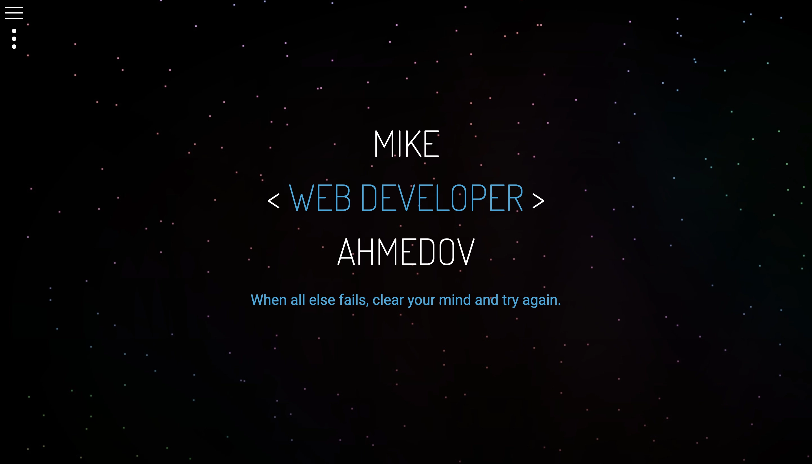
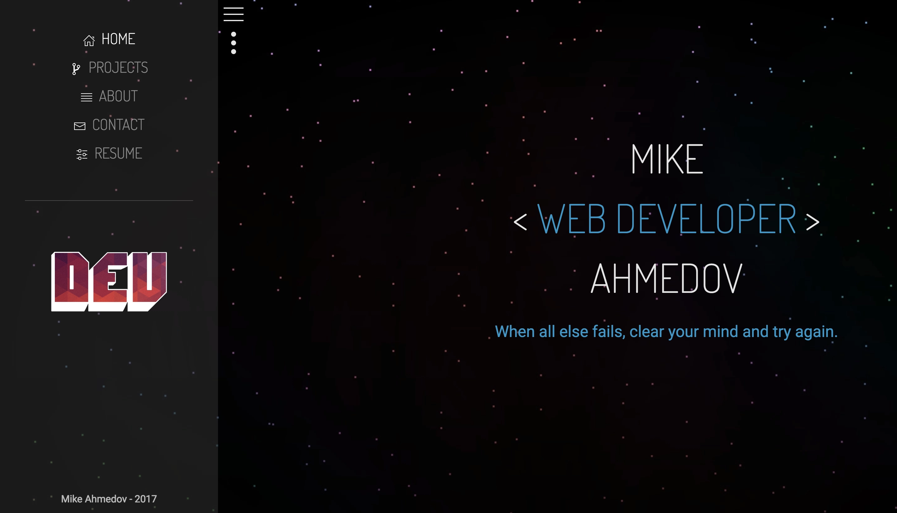
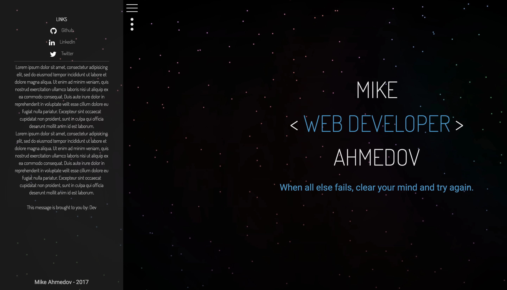

# devdot4 static website

Stack:
- uikit (main framework)
- jquery (for ome reason ¯\_(ツ)_/¯)
- animate.css (button animations)
- tilt.js (mousemove effects)

Image:

Deep Space from [Mysterious Space](http://store.steampowered.com/app/368700/Mysterious_Space/)

## Main Header

## Main Sidebar

## Info Sidebar

